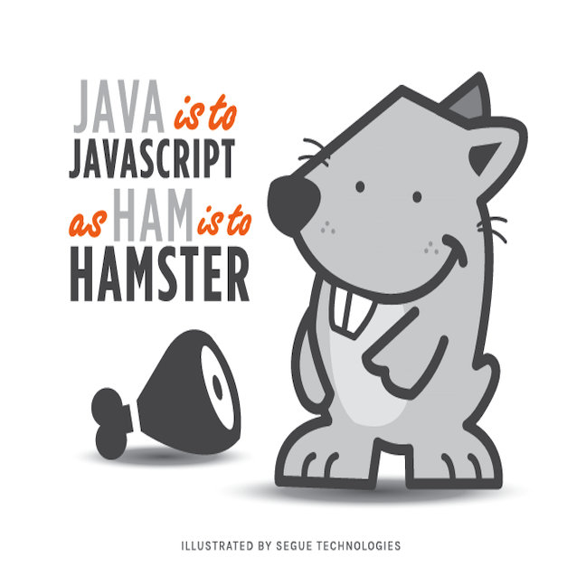
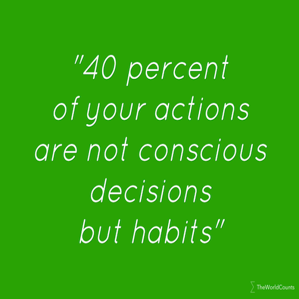

So far, I think the Javascript is fairly similar, but also different from Java. Right now, I am having a hard time with Javascript. I keep thinking in Java, and there are things that you can do in Javascript that you can not do in Java. Hopefully by the end of the semester, I will be able to think in either way and be able to distinguish them as I write out a code.

I am not entirely sure what makes a programming language good or bad in software engineering. I hope that by the end of the ICS 314, I will have a better understanding of software engineering, so I can have a better perspective if Javascript is a good or bad programming language.

I did find the practice WODs helpful, it allowed me more practice with Javascript . It has been a while, since the last time I had a programming class. Although, I remember the basics, I am still a bit rusty when it comes to programming. I love the way the class is ran, I feel like this way of teaching is very beneficial because it allows us to get more practice done. My coaches have always told us that you have to do something for 21 days straight for it to become a habit, and I feel that applies to programming too. The more days you practice, the easier it will become for you.

