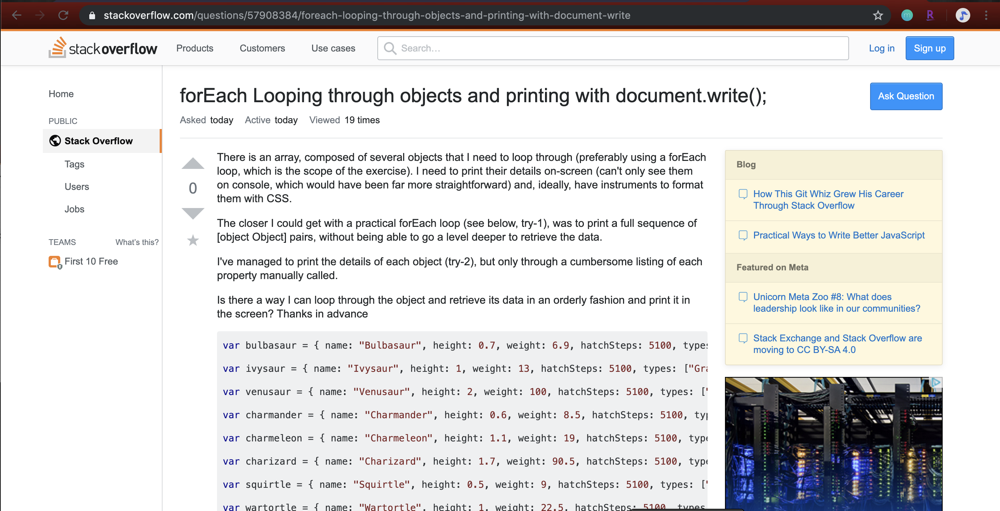

## "Dumb" Questions :thumbsdown: :thumbsdown:

We have always been told that there are no "dumb" questions. Sure, there are no such things as "Dumb Questions", but there are questions that should be more thought out and descriptive. On StackOverflow, there are people who post questions whose answers are easy to find. 

In the image above, the person is asking for the syntax to loop through all the entries in an array using javascript. The person doesn't give any other information about what exactly they want their code to do, or even an example of their code. You can find that answer just by searching it on the web. 

## "Smart" Questions??  :thumbsup: :thumbsup:

What exactly is a "Smart" question? Anything that is being asked is a question, obviously. But there are questions, and then there are "Smart" questions. "Smart" questions allow the person who answers it to know exactly what it is you are asking. They don't have to you ask other questions in order to get a better understanding of what it is you are asking. "Smart" questions are well thought out, very through, and not basic, to say the least.

In the image above, the person included their code, as well as a description of what it is they want to do and also what happens when they run their current code. When you look through the answers given, people know exactly what it is the person is asking for, so they share a solution and not more questions for the original asker to answer.
