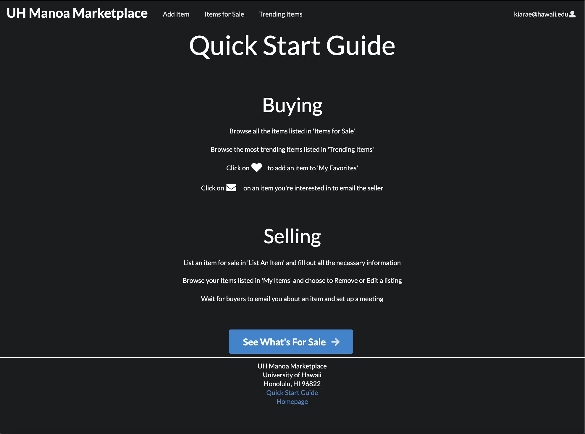

Manoa Marketplace is a Craigslist for students, faculty, and staff at the University of Hawaii at Manoa. My group and
 I created this web application as a way to buy things within the UHM community. On Craigslist, there are so many
  fake accounts. The perks about this application is that users need to register using their @hawaii.edu email, by
   doing so they are now held responsible for their actions. Each @hawaii.edu email is linked to specific people who
    either work or attend the school, if they decide to post something inappropriate, then the admins of the program
     can see exactly who these people are and whether or not some kind of punishment is needed based of the severity. 
     
For this project, I was in charge of making the landing page, adding small additions to certain pages, creating an
 add items page, and creating a messages page. Although the messages page never worked, we ended up changing the idea
  to when you want to buy an item, an email will be sent to the seller. In addition to this, I was also in charge of
   making sure the homepage was up to date on every change that we made. 
   
To learn more about UH Manoa Marketplace, [click here](https://uh-manoa-marketplace.github.io/)

To view our application, [click here](http://uh-manoa-marketplace.meteorapp.com/#/)

