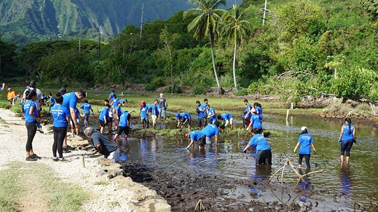

I have been volunteering with Live Kokua for the past two years. My sister is an employee for Bank of Hawaii and signs me up for as much days we can make. Every month Live Kokua volunteers with Paepae o Heeia, which is a program to restore the Loi Heeia Loi patch. Every month they have us doing different jobs. We have rebuilt the Kuapā, or the rock wall, and also chopped down the mangroves which is an invasive species.

I have also done numerous beach clean-up around Oahu. I have gone from Waimanalo to Diamond Head to Keehi. Cleaning up the beaches is important for our environment as well as the ocean. When people throw their garbage and miss the trash can, that garbage could end up in the water and possibly kill the sea life. 

