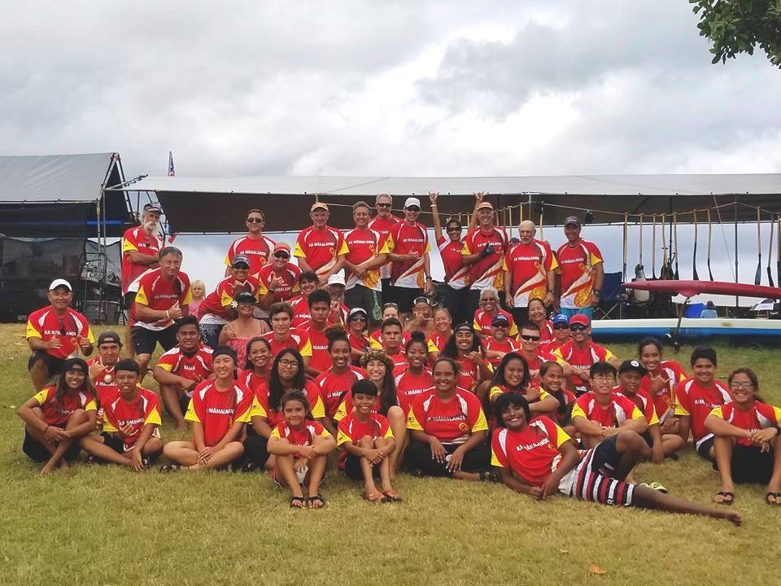

My Junior year of High School, I joined an Outrigger Paddling club, Ka Mamalahoe. I joined because my High School hired another coach, who also happened to coach a club. I followed him because he needed girl paddlers. I raced for Ka Mamalahoe during Na Opio Season, Pre-Season, as well as Summer Regatta Season. The 2 years I paddled for him, I was a part of the 16s' Girls and 18s' Mix in 2016 and the 18s' Girls in 2017. Both years, I qualified with the Girls team. If the 18s' Mix was a race in States, our crew would have qualified because we were in the top 2 for our Association Hui Waa

It was surprising to qualify because the majority of us had just started paddling for club, although we raced for our High Schools, club is a lot of challenging. 
