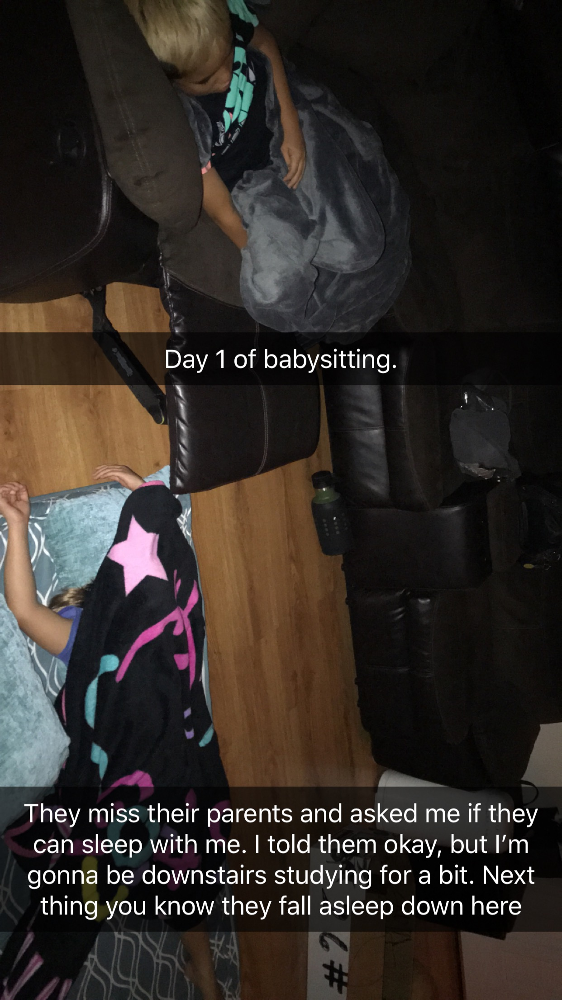

I became an aunt at the age of 7, I loved having a baby around because all of my sisters were older and didn't want to play toys with their baby sister. From the time I was 10 years old, I have been babysitting children. At first, it started out as just watching my sister's kids when they wanted to go out and relax for a night. After watching their kids for a few years, their friends would ask if I could watch their kids. 

Once I turned 16 and got my license, the one night of babysitting, soon turned into babysitting for up to two weeks. Although I was on the younger side, I had to learn responsibility because I was no longer responsible for myself but for kids younger than me and that is a big responsibility. 

Watching kids for a long duration, you pick up on many traits needed for when you start your own family. There are times where babysitting you need to have fun with the kids, so they don't miss their parents as much; but, you need to remember to pick up the kids from school, their practice times, making meals, and also making sure the kids are doing what they are supposed to do when their parents aren't there such as homework and cleaning up after themselves. 
